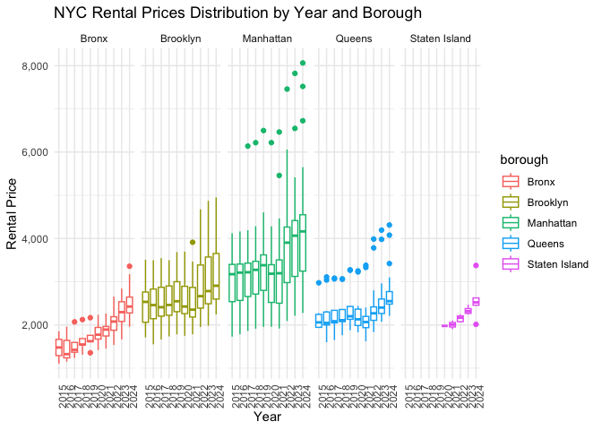
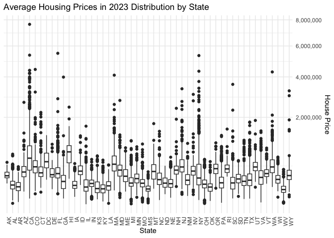
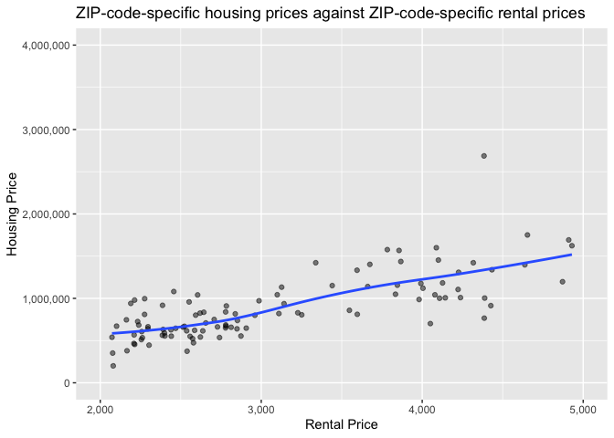

p8105_mtp_yx2954
================
Yiran Xu
2024-10-18

``` r
library(knitr)
library(rvest)
library(tidyverse)
library(scales)
```

# Problem 1

Goal: take a look on the trend of home value across US and rent within
NYC from three raw dataset:

- zhvi_df: ZIP code level house price in each month of 2023
- zori_df: ZIP code level rent in each month between January 2015 and
  August 2024
- zip_df: neighborhood to which each ZIP code attaches

First tidy NYC rental data to make all prices in a single column, the
clean the column names.

``` r
zori_df = read_csv("data/Zillow/Zip_zori_uc_sfrcondomfr_sm_month_NYC.csv") |>
  pivot_longer(cols = "2015-01-31":"2024-08-31",
               names_to = "date",
               values_to = "rent") |>
  mutate(date = as.Date(date), 
         zip = RegionName)|>
  janitor::clean_names() 
```

Create a new column to store the corresponding borough name according to
the county name, and clean variable name.

``` r
url = "https://p8105.com/data/zip_codes.html"
zip_list = read_html(url) |>
  html_table() 

zip_df = 
  zip_list[[1]] |>
  mutate(borough = case_when(
    County == "New York" ~ "Manhattan",
    County == "Kings" ~ "Brooklyn",
    County == "Queens" ~ "Queens",
    County == "Bronx" ~ "Bronx",
    County == "Richmond" ~ "Staten Island")) |>
  janitor::clean_names() 
```

Duplicate Zip codes are identified

``` r
duplicate_zip = 
  zip_df |>
  filter(duplicated(zip_code))
```

``` r
duplicate1 = 
  zip_df |>
  filter(zip_code == "10463")

duplicate1
```

    ## # A tibble: 2 × 8
    ##   county   state_fips county_code county_fips zip_code file_date  neighborhood  
    ##   <chr>         <int>       <int>       <int>    <int> <chr>      <chr>         
    ## 1 Bronx            36           5       36005    10463 07/25/2007 Kingsbridge a…
    ## 2 New York         36          61       36061    10463 07/25/2007 Kingsbridge a…
    ## # ℹ 1 more variable: borough <chr>

``` r
duplicate2 = 
  zip_df |>
  filter(zip_code == "11201")

duplicate2
```

    ## # A tibble: 2 × 8
    ##   county   state_fips county_code county_fips zip_code file_date  neighborhood  
    ##   <chr>         <int>       <int>       <int>    <int> <chr>      <chr>         
    ## 1 Kings            36          47       36047    11201 07/25/2007 Northwest Bro…
    ## 2 New York         36          61       36061    11201 07/25/2007 Northwest Bro…
    ## # ℹ 1 more variable: borough <chr>

We know Kingsbridge and Northwest Brooklyn are not in Manhattan. Remove
the error row for quality control

``` r
zip_final_df = 
  zip_df |> 
  filter(!(borough == "Manhattan" & zip_code == "11201")) |>
  filter(!(borough == "Manhattan" & zip_code == "10463")) 
```

Then merge two date set and only keep neccessary columns

``` r
zori_final_df = left_join(zori_df, zip_final_df, by = c("region_name" = "zip_code")) |>
  select(-size_rank, -region_id, -region_name:-county_name, -county:-file_date) 
```

``` r
uni_zip = zori_final_df |>
  pull(zip) |>
  n_distinct()

uni_nbh = zori_final_df |>
  pull(neighborhood) |>
  n_distinct()
```

After tidy and clean the dataset, there are **17284** total observations
exist. **149** unique ZIP codes. **43** unique neighborhoods

First put all housing prices across time in a single column, then clean
column name into lower cases with underscore marks, and keep minimal
number of variables needed.

``` r
zhvi_df = read_csv("data/Zillow/Zip_zhvi_uc_sfrcondo_tier_0.33_0.67_sm_sa_month_2023.csv") |>
  pivot_longer(
    cols = starts_with("2023"),
    names_to = "date",
    values_to = "price"
  ) |>
  janitor::clean_names() |>
  mutate(zip = region_name,
           date = as.Date(date)) |>
  select(-size_rank, -region_id, -region_name, -region_type, -state_name, -metro: -county_name) 

head(zhvi_df)
```

    ## # A tibble: 6 × 5
    ##   state city  date         price zip  
    ##   <chr> <chr> <date>       <dbl> <chr>
    ## 1 TX    Katy  2023-01-31 479748. 77494
    ## 2 TX    Katy  2023-02-28 478434. 77494
    ## 3 TX    Katy  2023-03-31 477387. 77494
    ## 4 TX    Katy  2023-04-30 478611. 77494
    ## 5 TX    Katy  2023-05-31 480636. 77494
    ## 6 TX    Katy  2023-06-30 483795. 77494

# Problem 2

Not all ZIP codes has 116 observations. Because some house were not
being rent in some period and some may still under construction

``` r
zori_nzip = 
  zori_df |>
  pull(zip) |>
  n_distinct()

zip_nzip = 
  zip_df |>
  pull(zip_code) |>
  n_distinct()
```

There are **149** different ZIP in NYC Rental data and **320** different
ZIP in zip code data. This **171** discrepancy could be explained by
some non-residental ZIP code included in the zip code data and areas
where no house were for rent or the rental was not on Zillow platform.

``` r
avg_rent = zori_final_df |>
  group_by(borough, year(date)) |>
  summarize(mean_price = mean(rent, na.rm = TRUE)) |>
  pivot_wider(
    names_from = borough,
    values_from = mean_price
  )

kable(avg_rent, caption = "Average Rent by Borough and Year", col.names = c("year", "Bronx", "Brooklyn", "Manhattan", "Queens", "Staten Island"))
```

| year |    Bronx | Brooklyn | Manhattan |   Queens | Staten Island |
|-----:|---------:|---------:|----------:|---------:|--------------:|
| 2015 | 1759.595 | 2492.928 |  3022.042 | 2214.707 |           NaN |
| 2016 | 1520.194 | 2520.357 |  3038.818 | 2271.955 |           NaN |
| 2017 | 1543.599 | 2545.828 |  3133.848 | 2263.303 |           NaN |
| 2018 | 1639.430 | 2547.291 |  3183.703 | 2291.918 |           NaN |
| 2019 | 1705.589 | 2630.504 |  3310.408 | 2387.816 |           NaN |
| 2020 | 1811.443 | 2555.051 |  3106.517 | 2315.632 |      1977.608 |
| 2021 | 1857.777 | 2549.890 |  3136.632 | 2210.787 |      2045.430 |
| 2022 | 2054.267 | 2868.199 |  3778.375 | 2406.038 |      2147.436 |
| 2023 | 2285.459 | 3015.184 |  3932.610 | 2561.615 |      2332.934 |
| 2024 | 2496.896 | 3125.657 |  4078.440 | 2693.584 |      2536.442 |

Average Rent by Borough and Year

The average rental price increases with time across all boroughs. A
sudden decrease in the price was observed from 2019 to 2020 in Brooklyn,
Manhattan, and Queens. Manhattan has the highest rental price, followed
by Brooklyn, Queens, Staten Island and Bronx.

``` r
rent_drop_table = zori_final_df |>
  filter(date %in% c("2020-01-31", "2021-01-31")) |>
  mutate(date = year(date)) |>
  pivot_wider(names_from = date, values_from = rent, names_prefix = "year_") |>
  mutate(rent_drop = year_2020 - year_2021) |>
  group_by(borough) |>
  filter(rent_drop == max(rent_drop, na.rm = TRUE)) |>
  select(borough, zip, neighborhood, rent_drop)
```

    ## Warning: There was 1 warning in `filter()`.
    ## ℹ In argument: `rent_drop == max(rent_drop, na.rm = TRUE)`.
    ## ℹ In group 5: `borough = "Staten Island"`.
    ## Caused by warning in `max()`:
    ## ! no non-missing arguments to max; returning -Inf

``` r
kable(rent_drop_table, caption = "Max Rent Drop from 2020-2021 by Borough", col.names = c("borough", "zip", "neighborhood", "rent_drop"))
```

| borough   |   zip | neighborhood        | rent_drop |
|:----------|------:|:--------------------|----------:|
| Queens    | 11385 | West Central Queens | 216.97454 |
| Brooklyn  | 11211 | Greenpoint          | 437.93809 |
| Bronx     | 10461 | Southeast Bronx     |  16.45535 |
| Manhattan | 10007 | Lower Manhattan     | 912.59659 |

Max Rent Drop from 2020-2021 by Borough

The rental price in Bronx has almost no changes, while that in other 3
boroughs except Staten Island has dropped from Jan 2020 to Jan 2021. The
drop in Manhattan (**912.5965909**) was much higher than Queens
(**216.9745434**) and Brooklyn (**437.9380917**). No data was available
in Staten Island.

# Problem 3

``` r
zori_year_p = 
  zori_final_df |>
  mutate(year = year(date)) |>
  group_by(borough, zip, year) |>
  summarise(avg_price = mean(rent, na.rm = TRUE)) |>
  ggplot(aes(x = as.factor(year), y = avg_price, color = borough)) +
  geom_boxplot() +  
  facet_grid(~ borough, scales = "free_y") +
  labs(title = "NYC Rental Prices Distribution by Year and Borough",
       x = "Year", y = "Rental Price") +
  theme_minimal() +
  theme(legend.position = "right") +
  theme(axis.text.x = element_text(angle = 90, hjust = 1)) +
  scale_y_continuous(labels = comma)

zori_year_p
```

    ## Warning: Removed 531 rows containing non-finite outside the scale range
    ## (`stat_boxplot()`).

<!-- -->

Rental prices increased in the past 10 years. While being higher and
dispersedly distributed in Brooklyn and Manhattan, the rental prices are
more evenly distributed and lower in the other 3 boroughs. Upper
outliers are observed in Manhattan and Queens, meaning some luxury
apartment available. The Staten Island is lack of data prior to 2020.

``` r
zhvi_state = zhvi_df |>
  mutate(year = year(date),
         month = month(date)) |>
  group_by(zip, state) |>
  summarise(avg_price = mean(price, na.rm = TRUE)) |>
  arrange(desc(avg_price)) 
```

``` r
zhvi_state_p = 
  zhvi_state |>
  mutate(avg_price = as.numeric(avg_price)) |>
  ggplot(aes(x = as.factor(state), y = avg_price)) +
  geom_boxplot() +  
  labs(title = "Average Housing Prices in 2023 Distribution by State",
       x = "State", y = "House Price") +
  theme_minimal() +
  theme(axis.text.x = element_text(angle = 90, hjust = 1)) +
  scale_y_continuous(
    trans = "sqrt", 
    position = "right",
    labels = comma)

zhvi_state_p
```

    ## Warning: Removed 116 rows containing non-finite outside the scale range
    ## (`stat_boxplot()`).

<!-- -->

``` r
median_price_df =
  zhvi_state |> 
  group_by(state) |>
  summarise(median_price = median(avg_price, na.rm = TRUE)) |>
  arrange(desc(median_price))
```

The plot above shows the average ZIP code level housing price in 2023 in
different state. The five states with the highest median house prices
are **HI** (**8.3253613^{5}**), **CA** (**6.7411982^{5}**), **DC**
(**5.9227819^{5}**), **MA** (**5.3767054^{5}**), **CO**
(**4.8402223^{5}**). Most outlier are found above the boxes, indicating
some luxury houses available. The highest housing price was in **CA**
with a price of **7.6363618^{6}**

``` r
zhvi_NYC_df =
  zhvi_df |>
  filter(city == "New York") |>
  mutate(year = year(date)) |>
  group_by(zip) |> 
  summarize(avg_price = mean(price)) |>
  mutate(zip = as.numeric(zip))
```

``` r
zori_month_df = 
  zori_final_df |>
  mutate(year = year(date)) |>
  filter(year == "2023") |>
  group_by(zip) |>
  summarise(avg_rent = mean(rent))
```

``` r
rent_price_p = 
  inner_join(zori_month_df, zhvi_NYC_df, by = "zip") |>
  ggplot(aes(x = avg_rent, y = avg_price)) +
  scale_y_continuous(labels = comma, limits = c(0, 4000000)) +
  scale_x_continuous(labels = comma, limits = c(2000, 5000)) +
  labs(title = "ZIP-code-specific housing prices against ZIP-code-specific rental prices",
       x = "Rental Price", y = "Housing Price") +
  geom_point(alpha = .5) +
  geom_smooth(se = FALSE) 

rent_price_p
```

    ## Warning: Removed 41 rows containing non-finite outside the scale range
    ## (`stat_smooth()`).

    ## Warning: Removed 41 rows containing missing values or values outside the scale range
    ## (`geom_point()`).

<!-- -->

Most housing prices are distributed from 500,000 to 1,500,000; most
rental prices range from 2,000 to 4,000. Housing prices and rental
prices are positively correlated.

``` r
zip_diff = anti_join(zhvi_NYC_df, zori_month_df, by = "zip") |>
  nrow()

num_SI = 
  zori_final_df |>
  filter(borough == "Staten Island") |>
  pull(zip) |>
  n_distinct()
```

Limitations:

- Rental price dataset has **27** fewer ZIP code available compared to
  housing price dataset
- Only **8** ZIP code in Staten Island is presented.
- Only housing price in 2023 are available
- Incomplete time coverage for each ZIP code
